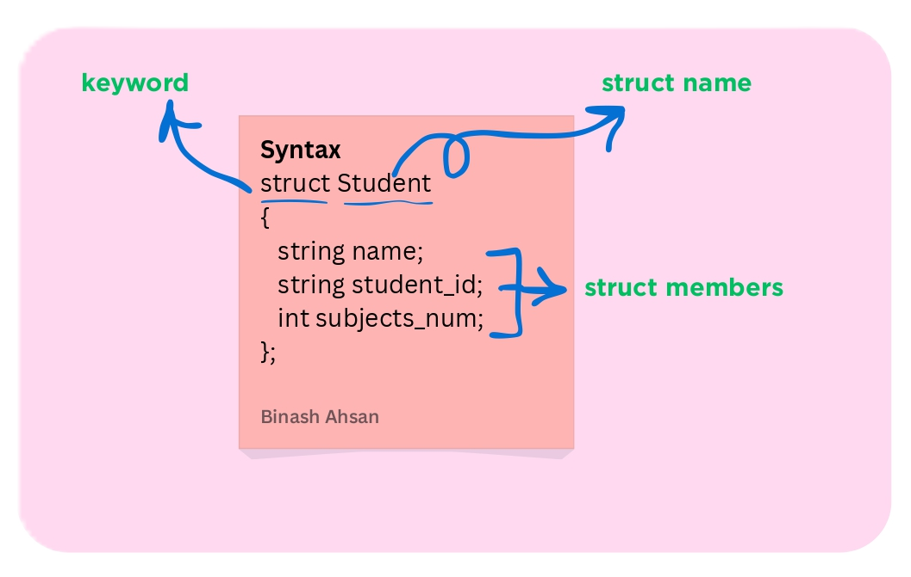

# Structs

## 🧠 What is a Struct?

A struct (short for structure) is a collection of variables of different data types. In fundamental programming, you’ve learned about basic variables like int for numbers and string for text. But what if you need to store related data as a single unit?

For example, imagine storing information about software engineering students—such as their name, student ID, and number of subjects. Creating separate variables for each student (e.g., 30 string variables for names, 30 for IDs, and 30 int variables for subject counts) would be inefficient and poor practice.

This is where structs come to the rescue! Instead of managing multiple individual variables, you can define a single custom data type (struct) that groups related sub-data types (int, string, float, char, etc.)

### Before Structs:
string student1_name = "Benish";  
string student1_id = "SE123";  
int student1_sub_no = 4;  

string student2_name = "Ahsan";  
string student2_id = "SE124";  
int student2_sub_no = 5;
.
.
.
last student variables

### After Using Structs:
 ```cpp
 // a blueprint for all students
struct Student {  
    string name;  
    string student_id;  
    int subjects_num;  
};
```
Now, Student acts like a user-defined data type, combining multiple sub-data types into one organized unit.

### Visual Representation


### Use of Structs:
For practical implementation, please check the .cpp file in the current folder.

